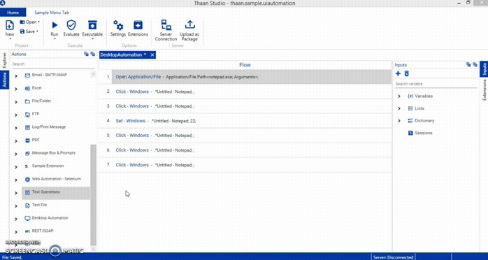
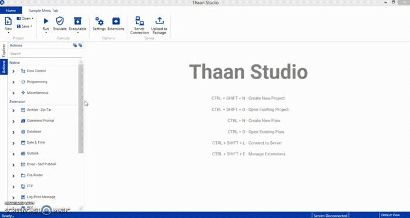
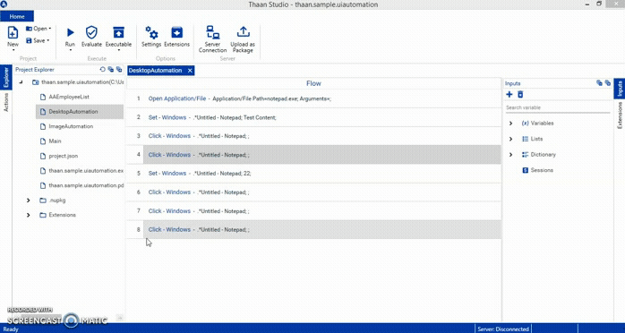
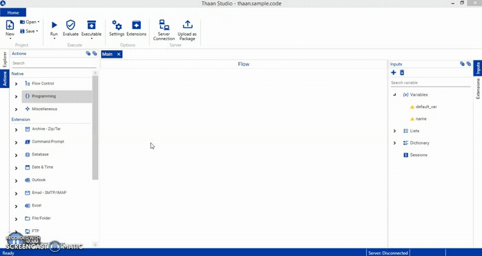
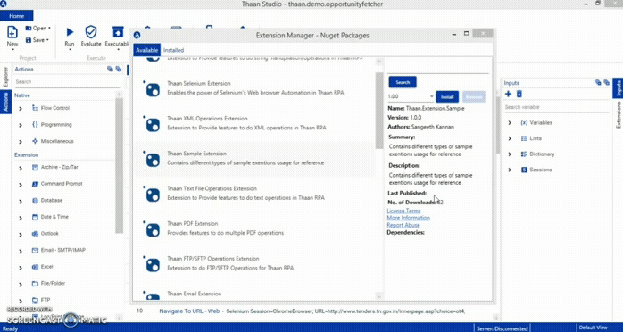
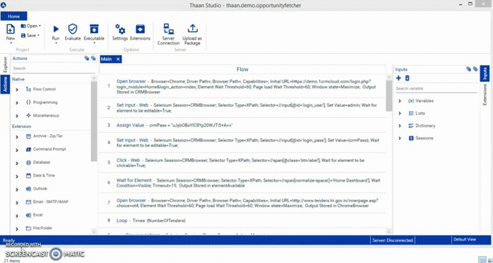
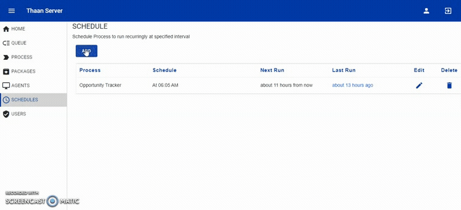
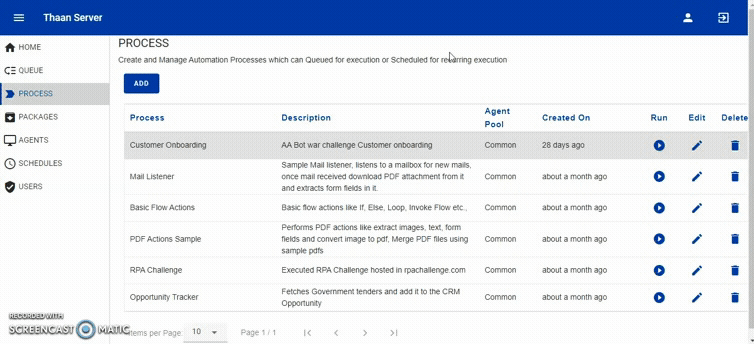
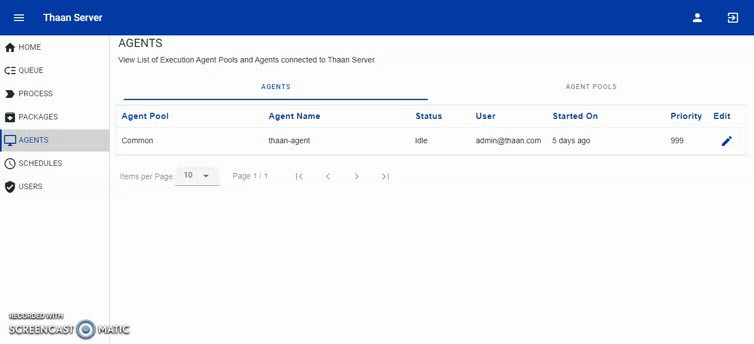

# 	**Thaan RPA** - Launching Soon!
A Simple &amp; Flexible RPA solution with enterprise grade architecture. Enabling citizen developers to Create and Manage automation bots effortlessly.

> The name "Thaan" / தான் is derived from the [Tamil](https://en.wikipedia.org/wiki/Tamil_language) word தானியங்கி (Tāṉiyaṅki) which means -
Automatic.

## Overview
Thaan RPA is a complete automation bundle comprised of Studio, Server and Agents to Design, Manage, Schedule and Run RPA Bots.

1. [**Thaan Studio**](https://github.com/rsangeethk/Thaan.RPA#Thaan-Studio) 
2. [**Thaan Server**](https://github.com/rsangeethk/Thaan.RPA#Thaan-Server)
3. [**Thaan Agent**](https://github.com/rsangeethk/Thaan.RPA#Thaan-Agent)

## Thaan Studio
Develop RPA bots with very simple and highly flexible studio powered by Nuget based extension capability. 250+ automation actions as extensions available and is a growing list.

1. **Simple & Flexible** - Very simple to use No code designer where anyone can start developing bots without any technical skills.

	

2. **Wide range of actions to automate** - 250+ extension actions available to automate Ex:, Windows, Web, PDF, Excel, Mail, REST, SOAP, DB ect., These are installable Nuget extensions and can be downloaded and installed within the Studio based on the automation requirement.

	

3. **Break the vendor lock-in - Export bots as .exe** - Export the bots as executable .exe file after development and break the vendor lock-in. After development, you are free to run the bots without Studio/Server dependency.

	

4. **Write C# code directly in the Thaan Studio** - Studio provides simple C# IDE to write C# code directly in the Studio and add it to the Bot flow.

	

5. **Studio UI is extendable too!** - The Application Menubar, Context Menu in Explorer and Flow view are extendable through Nuget extension packages which opens door for flexible new features without waiting for updates in Studio.

	

6. **Multiple flow views** - Cut the boredom of having single/dual view in the RPA Studios. New views can be added to Thaan Studio as Nuget Extensions. Why not? :)

	

## Thaan Server
Store, Manage, Monitor, Schedule and Run RPA bots from web based Server.

1. **Schedule Bots** - Schedule bots to run repetitively every few minutes/hours/days/months.

	

2. **View live logs** - View real-time logs of Bot execution directly from Server.

	
 
3. **Easy to connect Agents with Server** - Easily connect agents to server from any Windows machine.

	
 
4. **Intuitive Dashboard** - Provides overview of Number of Process, Agents, Schedules available also the simple Queued bot execution status chart and timeline chart.

	

5. **Manage Bots** - Bots developed in Studio can be uploaded as Nuget packages with versioning and then can be created as Processes to be used as attended or unattended bots.
 
6. **Manage Users** - Create/Edit/Delete users with Admin and User roles to access the Serverfrom Agent, Studio and Browser.

## Thaan Agent
Executes bots in the installed machine with complete control from Thaan Server. Broadcasts logs to Server in real time.

## System Specifications
Below specifications are minimum requirement for the applications to function.

**Thaan Studio**  - Windows 7+, .Net Framework 4+

**Thaan Server**  - Windows 7+ / Windows Server 2012+, .Net Core 3+

**Thaan Agent**   - Windows 7+, .Net Framework 4+

## Downloads
Launching Soon!! _(Watch this Repo to get updates on the Release dates)_

## Getting Started
Documentation to be released along with the Release.

## Let us know your thoughts
Drop a note to [ra.sangeeth.kannan@gmail.com](mailto:ra.sangeeth.kannan@gmail.com?subject=[Business%20proposal%20/%20Service%20Request]).
**Looking for Partners from BPM/RPA Service Industry to Collaborate.**
